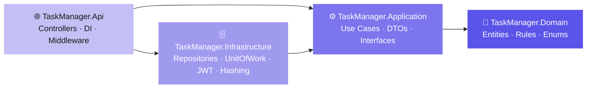
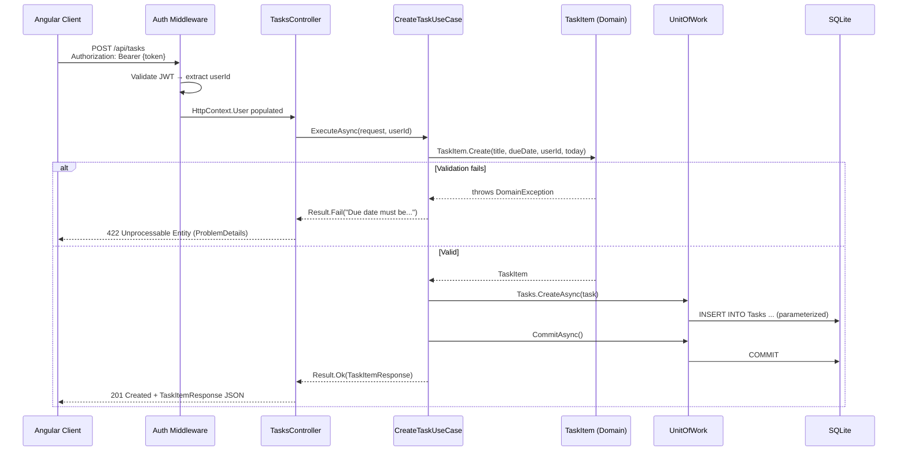
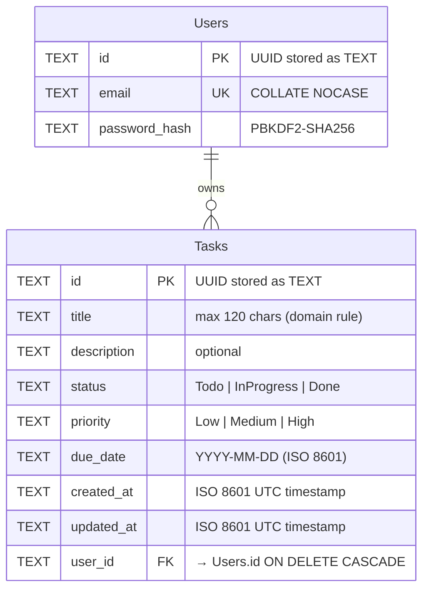
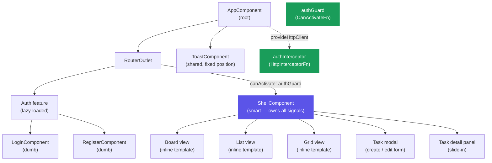

# Task Manager — Technical Assessment

Full-stack personal task manager built with **.NET 10** (Clean Architecture, TDD, raw ADO.NET)
and **Angular 18** (standalone components, signals, CSS design tokens).

- User story & acceptance criteria → [`docs/user-story.md`](docs/user-story.md)
- GenAI tool usage & prompt engineering → [`docs/genai-writeup.md`](docs/genai-writeup.md)

---

## Tech stack

| Layer | Tech |
|---|---|
| Backend runtime | .NET 10, C#, ASP.NET Core Web API |
| Data access | Raw ADO.NET — `Microsoft.Data.Sqlite` (no EF / Dapper) |
| Authentication | JWT HS256 — `Microsoft.AspNetCore.Authentication.JwtBearer` |
| Password hashing | `ASP.NET Core PasswordHasher<T>` (PBKDF2-SHA256) |
| Data store | SQLite (WAL mode, FK enforcement, indexed) |
| Test framework | xUnit + Moq |
| Frontend | Angular 18, TypeScript, RxJS, Signals |
| Frontend styling | Tailwind CSS + custom CSS design-token system |
| Frontend tests | Jasmine |

---

## Architecture

Clean Architecture with dependency direction enforced at **compile time** via project references.
A reference in the wrong direction is a **build error** — not a convention.



| Layer | Responsibility |
|---|---|
| **Domain** | Entities, value objects, domain rules, enums. Zero external dependencies. |
| **Application** | Use cases, DTOs, interfaces (`IUnitOfWork`, `ITaskRepository`, `IUserRepository`, `IPasswordHasher`, `ITokenService`, `IClock`). Depends only on Domain. |
| **Infrastructure** | ADO.NET repositories, `UnitOfWork`, `DatabaseInitializer`, `JwtTokenService`, `PasswordHasherService`. Implements Application interfaces. |
| **API** | ASP.NET controllers, DI wiring, JWT middleware, error middleware. Zero business logic. |

### Key patterns

| Pattern | Where | Purpose |
|---|---|---|
| **Result\<T\>** | All use cases | Use cases return `Result<T>` instead of throwing for business-rule failures. `DomainException` is reserved for unexpected/unrecoverable errors only. |
| **Unit of Work** | `IUnitOfWork` (Application) / `UnitOfWork` (Infrastructure) | Single transaction scope across repositories. `UnitOfWork` owns the `SqliteConnection` + `SqliteTransaction` lifecycle. |
| **Repository** | `ITaskRepository` / `IUserRepository` (Application) | Abstracts data access; swapping SQLite → PostgreSQL requires only an Infrastructure change. |
| **Factory Method** | `TaskItem.Create(...)` / `TaskItem.Reconstitute(...)` | `Create` enforces domain rules. `Reconstitute` bypasses due-date validation for rows already persisted. |

### Request lifecycle

End-to-end flow for `POST /api/tasks` — shows how each layer is crossed exactly once:



### Database schema



---

## Project structure

```
task-manager-assessment/
├── docs/
│   ├── user-story.md          # User story + Given/When/Then acceptance criteria
│   └── genai-writeup.md       # GenAI tool usage and prompt-engineering writeup
├── backend/
│   ├── TaskManager.sln
│   ├── Directory.Build.props  # Nullable=enable, ImplicitUsings=enable
│   ├── src/
│   │   ├── TaskManager.Domain/
│   │   ├── TaskManager.Application/
│   │   ├── TaskManager.Infrastructure/
│   │   └── TaskManager.Api/
│   └── tests/
│       ├── TaskManager.Domain.Tests/
│       ├── TaskManager.Application.Tests/
│       ├── TaskManager.Infrastructure.Tests/
│       └── TaskManager.Api.Tests/
├── frontend/
│   └── src/app/
│       ├── core/              # Models, services, guards, interceptors, validators
│       ├── features/
│       │   ├── auth/          # Login + Register (split left-panel layout)
│       │   └── tasks/shell/   # Main app shell: sidebar, board/list/grid views
│       └── shared/            # Toast notification component
├── docker-compose.yml
└── README.md
```

---

## Getting started

### Prerequisites

- [.NET 10 SDK](https://dotnet.microsoft.com/download)
- [Node.js 20+](https://nodejs.org) and Angular CLI (`npm i -g @angular/cli`)
- Docker (optional)

### Run with Docker (recommended for demo)

```bash
docker compose up
```

The API is available at `http://localhost:5000` and the frontend at `http://localhost:4200`.

### Run locally

```bash
# 1. Backend — configure the JWT secret (required)
cd backend
dotnet user-secrets set "Jwt:Secret" "your-super-secret-key-min-32-chars!!" \
  --project src/TaskManager.Api

# 2. Run the API
dotnet run --project src/TaskManager.Api
# → http://localhost:5000

# 3. Frontend (separate terminal)
cd frontend
npm install
ng serve
# → http://localhost:4200
```

### Demo credentials

Seeded automatically on first run by `DatabaseInitializer`:

| Email | Password |
|---|---|
| `demo@taskmanager.com` | `Demo1234!` |

The seed also includes three sample tasks (Done, In Progress, Todo) so the board is populated on first login.

---

## Running tests

```bash
# Backend — all layers
dotnet test backend/TaskManager.sln

# Frontend
cd frontend && ng test
```

### Backend test results

| Project | Tests | Status |
|---|---|---|
| `TaskManager.Domain.Tests` | 21 | ✅ |
| `TaskManager.Application.Tests` | 54 | ✅ |
| `TaskManager.Infrastructure.Tests` | 24 | ✅ |
| `TaskManager.Api.Tests` | 21 | ✅ |
| **Total** | **120** | **✅ All green** |

Every acceptance criterion in [`docs/user-story.md`](docs/user-story.md) maps to at least one test.

---

## API endpoints

All task endpoints require `Authorization: Bearer <token>`.

| Method | Path | Description | Auth |
|---|---|---|---|
| `POST` | `/api/auth/register` | Create account | Public |
| `POST` | `/api/auth/login` | Sign in → JWT | Public |
| `GET` | `/api/tasks?page=1&pageSize=10` | Paginated task list (current user) | Required |
| `GET` | `/api/tasks/{id}` | Single task | Required |
| `POST` | `/api/tasks` | Create task | Required |
| `PUT` | `/api/tasks/{id}` | Update task | Required |
| `DELETE` | `/api/tasks/{id}` | Delete task | Required |
| `GET` | `/health` | Health check | Public |

Errors follow **RFC 7807 ProblemDetails** format.

---

## Frontend features

### Component structure



### Features

| Feature | Implementation |
|---|---|
| Auth | Login + Register with split accent-panel layout; JWT persisted in `localStorage`; functional `authGuard` + `authInterceptor` |
| Board view | 3 Kanban columns (Todo / In Progress / Done) with native HTML5 drag-and-drop |
| List view | Sortable table — click any column header to cycle asc → desc → default |
| Grid view | Auto-fill card grid with priority + status badges |
| Task detail | Slide-in side panel with inline status toggle, edit, delete |
| Task modal | Create / edit form with full validation (title max 120 chars, due date ≥ today) |
| Priority | High / Medium / Low with colour-coded badges across all views |
| Filters | Sidebar nav filters (All / Todo / In Progress / Done) with live counts |
| Search | Live search on title + description |
| Pagination | Paginator for List and Grid views (6 / 9 / 12 / 24 items per page) |
| Theme | Light / Dark toggle via CSS custom properties |
| Skeletons | Loading skeleton states for all three view modes |
| Toasts | Feedback notifications styled in the design system (white text on colour) |

### UI / Design

The visual design was driven by a Figma prototype and refined using **Claude Design** to iterate on layout, color tokens, and component hierarchy before writing any Angular code.

- Figma reference: [Task Manager – UI Screens](https://www.figma.com/design/GGFTBSLa5Ygx2np2cukqsP/Task-Manager-%E2%80%93-UI-Screens?node-id=0-1&t=BHjLO8lcTtFWgucU-1)
- Tool used: [Claude Design](https://claude.ai/design) — imported the prototype, explored layout and spacing decisions, then translated the output into a CSS custom property token system

The design-to-code workflow:
1. Figma prototype defined the visual language (sidebar layout, card hierarchy, color palette, typography).
2. Claude Design was used to review the prototype and surface component boundaries, token naming, and interaction patterns before implementation.
3. The design tokens (`--bg`, `--surface`, `--accent`, etc.) were derived from the Figma color styles and implemented as CSS custom properties, enabling light/dark switching without JavaScript re-renders.

---

## Architectural decisions

### 1. Clean Architecture with compiler-enforced dependency direction

**Decision:** Four separate `.csproj` files — Domain, Application, Infrastructure, API — wired via project references in a single direction. No circular references, no shared-kernel shortcuts.

**Why:** Business rules must not depend on frameworks, ORMs, or databases. If the Domain project cannot even reference `Microsoft.Data.Sqlite`, it is structurally impossible to write a domain rule that leaks a database concern — the compiler rejects it before the code reaches a reviewer.

**Trade-offs:**
- More ceremony: 8 projects and 8 test directories for a CRUD app with two entities. This is disproportionate for a throw-away prototype.
- Cross-cutting changes (adding a new field) touch 4 files across 4 projects. With a monolith this would be 1 file.

**Advantages:**
- Each layer can be tested in complete isolation. Application tests run with mocked repositories; they never touch SQLite. Domain tests need no DI container at all.
- A new developer can read the dependency graph and understand the entire system before opening a single source file.

**Scale path:** In a microservices evolution, the Domain and Application layers extract into a shared NuGet package without modification. A second service (e.g., a notification service) can reference the same package and share domain types while owning its own Infrastructure and API. The dependency direction stays identical.

---

### 2. Raw ADO.NET with parameterized queries

**Decision:** `Microsoft.Data.Sqlite` only. Every query is hand-written SQL with `cmd.Parameters.AddWithValue(...)`. No EF Core, no Dapper, no query builder.

**Why:** The assessment requires it, and it enforces a discipline that is easy to lose with an ORM: you know exactly what SQL runs, when, and why. There are no lazy-loaded N+1 queries hiding inside a `.Include()` chain.

**Trade-offs:**
- Significantly more boilerplate. A simple paginated query requires a `WHERE` builder, a `COUNT(*)` command, a data reader with `GetOrdinal(...)` calls, and a manual mapping function. An ORM does all of this in two lines.
- No automatic change tracking. An `Update` operation requires explicitly re-passing all fields; there is no "detect what changed and build the minimal SQL."

**Advantages:**
- SQL is auditable. Every query in `TaskRepository.cs` can be reviewed for injection risk, index usage, and performance without running a profiler.
- ORDER BY injection is explicitly prevented via an allowlist dictionary (`SortColumnMap`) — a risk that ORMs usually handle transparently but that hand-written SQL forces you to think about.
- Zero query surprise in production. The exact SQL in the source file is the exact SQL on the wire.

**Scale path:** The `ITaskRepository` and `IUserRepository` interfaces in Application are the seam. Replacing the ADO.NET implementation with Dapper (for less boilerplate) or EF Core (for migrations and change tracking) requires only rewriting the Infrastructure layer. No Application, Domain, or API code changes. This is the point of the Repository pattern.

---

### 3. Unit of Work owning the transaction scope

**Decision:** `IUnitOfWork` (defined in Application) exposes `Tasks`, `Users`, and `CommitAsync()`. Use cases receive `IUnitOfWork` from DI — they never touch `SqliteConnection` or `SqliteTransaction` directly.

**Why:** A use case may write to two tables (e.g., register user, then create seed task). If the second write fails, the first must roll back. Without a transaction scope the use case manages, it must either hope the caller wraps it in a transaction or re-implement rollback logic in the use case itself — both are wrong.

The Unit of Work makes atomicity a property of the use case, not the caller.

**Trade-offs:**
- A single `SqliteConnection` per `UnitOfWork` means no parallel queries within a single use case. Each query runs sequentially on the same connection.
- After `CommitAsync()`, the same `UnitOfWork` instance switches to autocommit mode. This is intentional (subsequent reads in the same request still work), but it requires knowing this contract.

**Advantages:**
- Rollback is automatic: `DisposeAsync()` rolls back any uncommitted transaction. A use case that throws before `CommitAsync()` leaves the database untouched — no explicit `try/finally` needed in the use case.
- The `IClock` and `IUnitOfWork` interfaces in Application mean Application use cases are 100% testable with Moq — no SQLite file, no file system, no network.

**Scale path:** With PostgreSQL via Npgsql, `UnitOfWork` is rewritten to wrap `NpgsqlConnection` + `NpgsqlTransaction`. The `IUnitOfWork` interface in Application is identical. No use case changes. Npgsql also supports async savepoints for nested transactions if a use case needs partial rollback within a larger operation.

---

### 4. Result\<T\> pattern for use case outcomes

**Decision:** Every use case returns `Result<T>` with a `ResultKind` discriminant (`Ok`, `Validation`, `NotFound`, `Conflict`, `Unauthorized`, `Forbidden`). `DomainException` is reserved for logic that should never be reached — programmer errors, invariant violations detected in Reconstitute.

**Why:** "User not found" and "wrong password" are normal, predictable outcomes — not exceptional events. Using exceptions for control flow means callers must know which exception types to catch, and any uncaught exception becomes a 500.

With `Result<T>`, every possible outcome is visible at the call site. Controllers switch on `ResultKind` and map deterministically to HTTP status codes.

**Trade-offs:**
- Every use case call site must check `result.IsSuccess` before reading `result.Value`. This is more verbose than `try { var value = await useCase.Execute(); }`.
- Composing use cases (one use case calling another) requires propagating `Result<T>` through the chain manually.

**Advantages:**
- The set of possible outcomes is compiler-visible. A reviewer can look at a use case signature and know exactly what can happen without reading the implementation.
- No accidental 500s from unhandled business exceptions. The only things that reach the global exception middleware are genuine programmer errors.
- Controllers become thin mappings from `ResultKind` to HTTP: `NotFound → 404`, `Conflict → 409`, `Validation → 422`. No business logic in controllers.

**Scale path:** A result-mapping middleware can be introduced that reads the `Result<T>` from a controller action filter and returns `ProblemDetails` automatically, removing the `switch` statement from every controller. This is a pure API-layer change — no use cases change.

---

### 5. Factory methods: Create vs. Reconstitute

**Decision:** `TaskItem` exposes two static factory methods. `Create(...)` validates all business rules (title ≤ 120 chars, due date ≥ today). `Reconstitute(...)` bypasses due-date validation and is called only by ADO.NET mapping code in the Infrastructure layer.

**Why:** Persisted rows may have due dates in the past — they were valid when created. Calling `Create(...)` to map a database row would reject all overdue tasks, making them unreadable. But the alternative of skipping validation in `Create(...)` would allow new tasks with past due dates.

Two factories solve this by being explicit about the intent: `Create` is for new objects, `Reconstitute` is for objects that have already been persisted and are trusted to be structurally valid.

**Trade-offs:**
- Two paths into the same object type. A future developer must know to call `Reconstitute` from repositories and `Create` from use cases, or validation silently stops working.
- `Reconstitute` could be called from use cases by accident. There is no compiler guard against this.

**Advantages:**
- Domain invariants are enforced exactly where they belong: at creation time for new objects, not at read time for existing ones.
- The intent of each factory is self-documenting. `Reconstitute` signals "this object came from storage, not from user input."

**Scale path:** If the domain grows complex (e.g., tasks with subtasks, recurring tasks), the factory methods become the entry points for object construction — never raw `new TaskItem(...)`. Additional invariants (e.g., subtask count limit) are added to `Create(...)` without touching `Reconstitute(...)`.

---

### 6. SQLite as the data store

**Decision:** SQLite with WAL journal mode, `PRAGMA foreign_keys=ON` per connection, a `user_id` index, and a `created_at` index. Schema is created and migrated at startup by `DatabaseInitializer`.

**Why:** Zero infrastructure dependency. The app starts with a `dotnet run` — no Docker, no database server, no connection string negotiation. For a take-home demo, this eliminates the most common "it doesn't run on my machine" failure.

**Trade-offs:**
- SQLite uses a single writer lock. Concurrent write-heavy workloads (multiple API instances writing simultaneously) will serialize and eventually time out under load. It is not suited for horizontal write scaling.
- No native `ARRAY`, `JSONB`, or full-text search. Features that are trivial in PostgreSQL require workarounds.

**Advantages:**
- The database is a single file. Backing up, resetting, or sharing the database for a demo is a file copy.
- WAL mode allows concurrent readers while a write transaction is open, which is sufficient for a single API instance under normal load.
- Foreign key enforcement (`PRAGMA foreign_keys=ON`) is set per-connection in `UnitOfWork`, meaning referential integrity is guaranteed regardless of how the connection is opened.

**Scale path:** Replace only the Infrastructure layer (see [Repository scale path above](#2-raw-adonet-with-parameterized-queries)). The schema translates directly to PostgreSQL or SQL Server — column types change (`TEXT` → `UUID`, `TEXT` → `TIMESTAMP WITH TIME ZONE`), but the table shape, indexes, and FK relationships are identical.

---

### 7. JWT with HS256 symmetric signing

**Decision:** JWT tokens signed with HMAC-SHA256 using a secret stored in `user-secrets` / environment config. Tokens include `sub` (user ID) and `email` claims. No refresh tokens for this scope.

**Why:** For a single API service, symmetric signing is the simplest correct choice. All instances share one secret; token verification requires only the secret and no external key store.

**Trade-offs:**
- If the secret is compromised, all outstanding tokens are compromised simultaneously. There is no way to rotate tokens without re-issuing them.
- Stateless JWTs cannot be revoked before expiry. Logging out on the client deletes the token from `localStorage`, but the token remains valid server-side until it expires.
- No refresh tokens means users must re-authenticate after the token expires.

**Advantages:**
- Zero key management infrastructure. The secret is an environment variable.
- Stateless auth means the API is horizontally scalable without a shared session store — each instance can verify any token independently.

**Scale path — HS256 → RS256:**
1. Generate an RSA key pair; store the private key in secrets manager, publish the public key as a JWKS endpoint.
2. Change `AddJwtBearer` signing credentials in `JwtTokenService.cs` to `RsaSecurityKey`.
3. No Domain, Application, or controller code changes — the claim shape is identical.
4. Add a refresh token table and `POST /api/auth/refresh` endpoint if token revocation or longer sessions are needed.

---

### 8. Password hashing with ASP.NET Core PasswordHasher\<T\>

**Decision:** `Microsoft.AspNetCore.Identity.PasswordHasher<T>` — in-box PBKDF2-SHA256 with a random per-user salt and an iteration count that ASP.NET Core can upgrade automatically.

**Why:** It is audited by Microsoft's security team, NIST SP 800-132 compliant, ships with the framework, and requires no additional NuGet packages. It handles salt generation, output encoding, and format versioning internally.

**Trade-offs:**
- The iteration count (default 310,000 for V3) is not tunable without subclassing. BCrypt or Argon2 offer a simpler tunable cost factor.
- No memory-hard guarantee. BCrypt and Argon2id are specifically designed to be expensive in memory, making GPU-based cracking harder.

**Advantages:**
- Zero extra dependencies.
- Format versioning is built in: if Microsoft increases the iteration count in a future release, `VerifyHashedPassword` returns `SuccessRehashNeeded` and the hash can be transparently upgraded on next login.

**Scale path:** Replace `PasswordHasherService` with an Argon2id implementation (e.g., `Isopoh.Cryptography.Argon2`) if memory-hard hashing is required. The `IPasswordHasher` interface in Application is unchanged; no use case or controller code is touched.

---

### 9. IClock abstraction for time-dependent logic

**Decision:** `IClock` interface with a `Today` property, implemented by `UtcClock` in production and replaced with a fixed date in tests.

**Why:** `DateOnly.FromDateTime(DateTime.UtcNow)` called inside a use case or domain entity makes time-dependent tests non-deterministic. A test that creates a task with `dueDate = today` fails at midnight. `IClock` makes "what is today?" an injectable dependency.

**Trade-offs:**
- One more interface and one more DI registration for what feels like a trivial concern.

**Advantages:**
- Every test that involves a due date injects a specific date. Tests run identically at midnight, in CI, or across time zones.
- Time-travel in tests becomes trivial: `IClock clock = new FakeClock(new DateOnly(2025, 1, 1))`.

**Scale path:** No change needed. If the system later needs scheduled tasks (e.g., send reminders for overdue items), `IClock` is already the canonical time source for the domain — scheduler logic reads from it rather than `DateTime.UtcNow`.

---

### 10. RFC 7807 ProblemDetails for error responses

**Decision:** A global exception middleware converts unhandled exceptions to `ProblemDetails`. Controllers map `ResultKind` to the appropriate HTTP status and return `ProblemDetails` with a `detail` field carrying the error message.

**Why:** Without a standard error shape, every error response is ad-hoc. Frontend code accumulates `if (error.error?.message)` checks for every possible structure. RFC 7807 defines `type`, `title`, `status`, `detail`, and `instance` — fields that clients can rely on without inspecting the response body structure.

**Trade-offs:**
- Slightly more verbose error responses than a bare `{ "error": "..." }` JSON object.
- `type` field should be an absolute URI pointing to documentation; for this scope it is a relative identifier.

**Advantages:**
- Machine-readable status code + `type` field pair. An API gateway or monitoring system can classify errors without parsing human-readable strings.
- Consistent error handling in the Angular interceptor: one `error.error.detail` lookup covers every API error.
- Stack traces never reach the response body — the global middleware catches all unhandled exceptions and returns a generic 500 ProblemDetails.

---

## Frontend design decisions

### 11. Signals and computed for all local state

**Decision:** All mutable state in `ShellComponent` is declared with `signal()`. All derived state (filtered tasks, sorted page, board columns, pagination numbers) uses `computed()`. No explicit `subscribe()` calls within the component.

**Why:** Angular's signal-based reactivity (introduced in Angular 17) computes derived values lazily and only when their dependencies change. A `computed()` that derives sorted tasks from a page of tasks only re-runs when `tasks`, `sortCol`, or `sortDir` change — not on every render cycle.

**Trade-offs:**
- Signals are a relatively new Angular feature. Developers familiar with RxJS Observables need to learn a different mental model for local synchronous state.
- Async operations (HTTP calls) still return Observables. The boundary between Observable streams and signals requires `toSignal()` or explicit `.subscribe()` with `signal.set()`.

**Advantages:**
- No `ngOnDestroy` + `takeUntilDestroyed` boilerplate. Computed signals clean themselves up when the component is destroyed.
- Fine-grained change detection: only the template sections that read a changed signal re-evaluate. This is a stepping stone toward `changeDetection: ChangeDetectionStrategy.OnPush` or fully zone-less apps.

**Scale path:** If state needs to be shared across multiple routes (e.g., a notification badge that reads the task count), extract the signals into a `@ngrx/signals` signal store. The component binds to store signals rather than local ones — the template is unchanged.

---

### 12. Smart/dumb component split

**Decision:** `ShellComponent` is the single smart component — it owns all signals, calls `TaskService`, and handles user events. Presentational sub-components (board card, list row, task modal) receive data via `@Input()` and emit events via `@Output()`.

**Why:** A component that mixes data fetching, state management, and template rendering is hard to test in isolation and impossible to reuse. Separating concerns means the board card can be tested by simply passing an `@Input() task` — no `HttpClient`, no service mocks needed.

**Trade-offs:**
- `ShellComponent` at 500+ lines is large. All three views (board, list, grid) live inside one component, which makes it a single point of change for many unrelated features.
- Passing data down and events up through multiple levels (prop drilling) becomes painful as depth increases.

**Advantages:**
- Presentational components are deterministic: given the same inputs, they always render the same output. This makes visual regression testing straightforward.
- `ShellComponent` can be replaced with a different smart shell (e.g., one backed by a WebSocket stream) without touching any presentational component.

**Scale path:** Split the shell into multiple routed feature components (one per view), each with its own smart shell. Share state via a signal store or a `TasksFacade` service. The presentational components require no changes.

---

### 13. CSS custom property design token system

**Decision:** All colors are defined as CSS custom properties (`--bg`, `--surface`, `--accent`, etc.) in `:root` for light mode and overridden in `.dark` for dark mode. Components reference `var(--accent)` rather than any hardcoded hex value.

**Why:** Light/dark theming via Angular typically involves toggling a service, updating a signal, triggering change detection, and re-rendering the component tree. With CSS custom properties, switching themes is a single `document.documentElement.classList.toggle('dark')` call — CSS handles the rest with zero JavaScript re-render.

**Trade-offs:**
- The current theme value lives in the DOM (the presence of a CSS class) and in an Angular signal. These two sources of truth must stay in sync manually.
- Reading the theme value in TypeScript (e.g., to pass a chart color) requires reading the signal, not the CSS variable. CSS variables are not accessible to TypeScript at compile time.

**Advantages:**
- Theme switching is instantaneous. There is no Angular change detection cycle, no Observable emission, no component re-render — the browser applies the new CSS variable values immediately.
- Adding a new color to the design system requires adding one line to `:root` and one line to `.dark`. Every component that references that token updates automatically.
- Design tokens are self-documenting: `var(--accent)` communicates intent better than `#5b54e8`.

**Scale path:** Extract the token definitions into a shared CSS file importable by a design system package. Tokens can be generated from a Figma design token export (via Style Dictionary or Theo) and overridden per-brand without touching component code.

---

### 14. Native HTML5 drag-and-drop for the Kanban board

**Decision:** Browser-native DnD API (`dragstart`, `dragover`, `drop` events) instead of Angular CDK `DragDropModule`.

**Why:** CDK DragDrop adds ~20 KB to the bundle and requires significant API surface to configure (connectedTo, orientation, sorting). For a 3-column Kanban board where the only interaction is "move card from one column to another," the native API achieves the same result in ~30 lines with no dependencies.

**Trade-offs:**
- The native API provides limited visual feedback during drag (browser ghost image only). CDK offers custom drag handles, animated placeholder, and full control over the drag preview.
- Mobile touch events are not handled by the native DnD API. Touch-based Kanban requires either a pointer events polyfill or CDK.

**Advantages:**
- Zero bundle size impact.
- No breaking changes from CDK version upgrades.
- Works in all modern browsers without configuration.

**Scale path:** Replace with Angular CDK `DragDropModule` if mobile touch support, multi-list animations, or virtual scrolling are required. The component's event handlers (`onDragStart`, `onDrop`) map directly to CDK's `cdkDragStarted` and `cdkDropListDropped` outputs — the migration is a template-level change, not a logic change.

---

### 15. Functional authGuard and authInterceptor

**Decision:** Authentication is implemented as two pure functions: `authInterceptor: HttpInterceptorFn` (attaches the JWT to every outgoing request) and `authGuard: CanActivateFn` (redirects unauthenticated users to `/login`).

**Why:** Angular 15+ made class-based interceptors and guards legacy. Functional equivalents are simpler (no class boilerplate, no `implements` declaration), tree-shakeable, and composable — multiple guard functions can be passed to `canActivate: [authGuard, roleGuard]` without a wrapper class.

**Trade-offs:**
- `inject()` must be used inside the function body for dependency injection. This is a different pattern from constructor injection and can be surprising when first encountered.
- Unlike class-based guards, functional guards cannot retain state between invocations without a service.

**Advantages:**
- The entire JWT attachment logic is 5 lines of code. A new developer can read and verify it in under a minute.
- Functional interceptors compose: adding a logging interceptor is `provideHttpClient(withInterceptors([authInterceptor, loggingInterceptor]))` — order is explicit and visible at the DI registration site.

**Scale path:** Add additional functional guards to the `canActivate` array as needed (e.g., a `featureFlagGuard`, a `roleGuard`). Guards compose without class inheritance or decorator magic.

---

### 16. NgRx deliberately excluded

**Decision:** No NgRx (neither `@ngrx/store` nor `@ngrx/signals`). All state is managed with Angular's built-in `signal()` and `computed()` inside `ShellComponent`.

**Why:** NgRx solves real problems — but only at a scale this app does not reach. The problems NgRx addresses are:

- **Shared state between many unrelated components.** This app has one smart component (`ShellComponent`). There is no cross-route state sharing problem to solve.
- **Complex async coordination** (optimistic updates, cache invalidation, action queuing). Every operation here is a single HTTP call followed by a full data reload. There is no race condition to manage.
- **Time-travel debugging and audit log of mutations.** Valuable in a large team; overkill for two entities.

Adding NgRx at this stage would mean writing Actions, Reducers, Effects, Selectors, and a Store module for a feature that today fits in one component. That is roughly 200 lines of boilerplate added to achieve the same result as 10 lines of signals — a net negative for readability and onboarding.

**The rule of thumb used here:** introduce a state management library when signals and services can no longer hold the complexity, not before. Recognizing when *not* to add a dependency is part of the engineering judgment this project is evaluated on.

**Trade-offs:**
- All state lives in one component. If a second route needs the task list (e.g., a dashboard widget), the state must be lifted into a service or duplicated.
- No built-in DevTools integration for inspecting signal state (unlike NgRx DevTools).

**Advantages:**
- Zero boilerplate. The signal model is readable without knowing NgRx conventions.
- No version coupling. NgRx and Angular version alignment is an ongoing maintenance cost avoided here.
- Faster initial load — no NgRx store module in the bundle.

**Scale path:** When cross-route state sharing becomes necessary, extract the signals from `ShellComponent` into an `@ngrx/signals` signal store. The template bindings (`task()`, `loading()`) are identical — only where those signals are declared changes. The migration is additive, not a rewrite.

---

## Out of scope (deliberate)

The following were intentionally excluded. Each represents a real production concern — the exclusion is a scope decision, not an oversight.

| Feature | Why excluded | How to add |
|---|---|---|
| Refresh token rotation | Adds a `RefreshTokens` table, a `/auth/refresh` endpoint, and client-side token lifecycle management — disproportionate for a demo | New `RefreshToken` entity in Domain; new use case; Angular interceptor retries on 401 |
| Rate limiting | ASP.NET Core 8+ has built-in rate limiting middleware | `builder.Services.AddRateLimiter(...)` in `Program.cs`; no use case changes |
| Polly retry / circuit breaker | Resilience belongs at the HTTP client or infra layer for transient failures | `builder.Services.AddResiliencePipeline(...)` with Polly 8; no use case changes |
| Task sharing between users | Requires a `TaskShares` join table and ownership model changes | New domain concept (shared read vs. write), new repository queries |
| Soft delete / audit history | `deleted_at` column + filter on all queries; event log table | `DeletedAt` on `TaskItem`; all repository queries add `WHERE deleted_at IS NULL` |
| Distributed tracing | OpenTelemetry with Jaeger or Azure Monitor | `builder.Services.AddOpenTelemetry()` — no business logic changes |
| Playwright E2E tests | Time-consuming for a take-home; covered by 120 unit + integration tests | Add a `tests/e2e` project; reuse the seed credentials |
